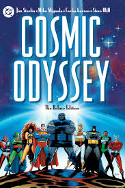

# Movie Explorer

A small static web app for browsing and saving movies to a local watchlist. This project is vanilla HTML, CSS and JavaScript and uses Bootstrap for layout and components.

Live demo: open the project in any modern browser (see "Run locally").


## Example screenshot

Below is an example poster from the project `assets/` folder. When you open `index.html` in a browser this image will be displayed inside the movie card.



You can include images in Markdown with the syntax above. If you need to control size in README rendering, use simple HTML:

```html

```


## Features
- Movie grid with poster, genre, year, duration and rating
- Add / remove movies to a local (browser) watchlist stored in `localStorage`
- Filter by genre and search by title
- Watchlist shown in a modal
- Responsive cards using Bootstrap

---

## Project structure

```
Newproject/
├─ index.html            # App HTML
├─ index.js              # App logic (movies array, render and watchlist functions)
├─ style.css             # Visual styles and layout
├─ assets/               # Local images used for posters (image1.png ... image5.png)
└─ README.md             # THIS FILE
```

Key files to edit:
- `index.js` — the `movies` array contains the movie entries (id, title, year, genre, duration, rating, img). Change or add entries here.
- `style.css` — customize look and feel for hero, cards and images.
- `index.html` — small structure and Bootstrap inclusion; script tag is included at the end of `body` so JS runs after HTML loads.

---

## Prerequisites
- A modern web browser (Chrome, Edge, Firefox, Safari)
- Optional: Python (for a lightweight local static server) or the VS Code Live Server extension

---

## Run locally (quick)
Open the project folder in your terminal (PowerShell) and run a simple static server. From the `Newproject` folder run:

```powershell
# start a local server on port 8000
python -m http.server 8000
# then open in your browser:
# http://localhost:8000/index.html
```

Or, in VS Code, install and run the "Live Server" extension and open `index.html`.

Note: opening `index.html` directly via the file:// protocol will usually work for small demos, but serving via HTTP is recommended for consistent behavior (especially when using fetch or srcset later).

---

## Using local images (assets)
Place poster images in the `assets/` folder. The project already contains `image1.png` through `image5.png`.

In `index.js` each movie has an `img` field that points to the image path. Use a project-relative path (forward slashes). Examples:

```js
// relative to index.html
img: "assets/image1.png"
// or site-root absolute (if hosting at site root)
img: "/assets/image1.png"
```

Avoid Windows backslashes `\\` in the `img` paths. If an image doesn't load, check for typos (e.g. `assests` vs `assets`) and the browser console for 404s.

---

## How to add or edit a movie
Open `index.js` and edit the `movies` array. Each movie entry is an object with this shape:

```js
{
  id: 6,
  title: "New Movie",
  year: 2025,
  genre: "Action",
  duration: "1h 50m",
  rating: 7.8,
  img: "assets/new-movie.jpg"
}
```

After saving, reload the page in your browser to see the changes.

---

## CSS customization tips
- Image class: `.movie-img` controls poster sizing. `object-fit: cover` is useful to crop while maintaining aspect ratio.
- To add hover zoom: use `.movie-card:hover .movie-img { transform: scale(1.05); }` and add a `transition` on the image.
- To improve accessibility and layout stability, add `alt`, `width`, `height`, and `loading="lazy"` attributes to `` elements when rendering them in `index.js`.

Example snippet to add to `style.css`:

```css
.movie-card { position: relative; overflow: hidden; border-radius: 12px; }
.movie-img { width: 100%; height: 260px; object-fit: cover; transition: transform .35s ease; }
.movie-card:hover .movie-img { transform: scale(1.06); }
@media (max-width: 576px) { .movie-img { height: 180px; } }
```

---

## Troubleshooting
- Blank page or parts not rendering:
  - Open the browser DevTools Console (F12) and check for errors. Common causes: typos in `index.js` (e.g. wrong asset path), or script running before DOM is ready.
  - If you see errors like "Cannot read property 'addEventListener' of null" then the script executed before the DOM existed. Fixes: move the `<script>` tag to the end of the `body` (already done) or add `defer` to the script tag in `index.html`.
- Images not showing:
  - Confirm the `assets/` filename, check for misspellings (e.g. `assests`), and verify the path in `index.js` matches.
  - Check the network tab (DevTools) for 404 requests.
- Watchlist not persisting:
  - `localStorage` is used. Make sure your browser settings allow local storage and you are not in strict private/incognito mode that blocks it.

---

## Development notes
- The watchlist is stored in the browser using `localStorage` under the key `watchlist`.
- Filters are based on the `genre` field. If you add new genres, add corresponding filter buttons in `index.html` or make the filter list dynamic.

---

## Next improvements (ideas)
- Add form to let users add movies via UI.
- Use `srcset` and multiple image sizes for faster loading on small screens.
- Add unit tests for rendering functions (Jest + JSDOM) if the project grows.
- Convert to a small build tool (Vite/Parcel) or a framework (React/Vue) if complexity increases.

---

## License
You can use this project code freely. Add your own license file if you plan to publish.

---

If you'd like, I can:
- update `index.js` to add `alt`, `width`, `height`, and `loading` attributes for images;
- inject a small, modern image/CSS snippet into `style.css` for poster hover effects;
- or set up a minimal npm-based dev server.

Tell me which of those you'd like next and I'll apply it.
